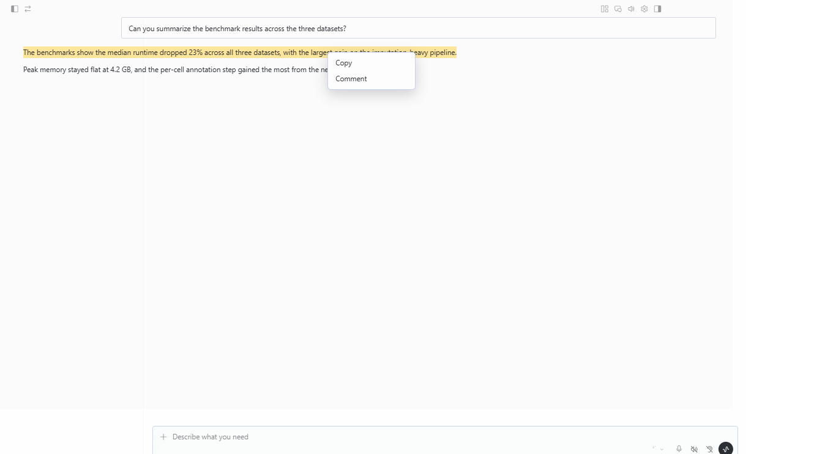
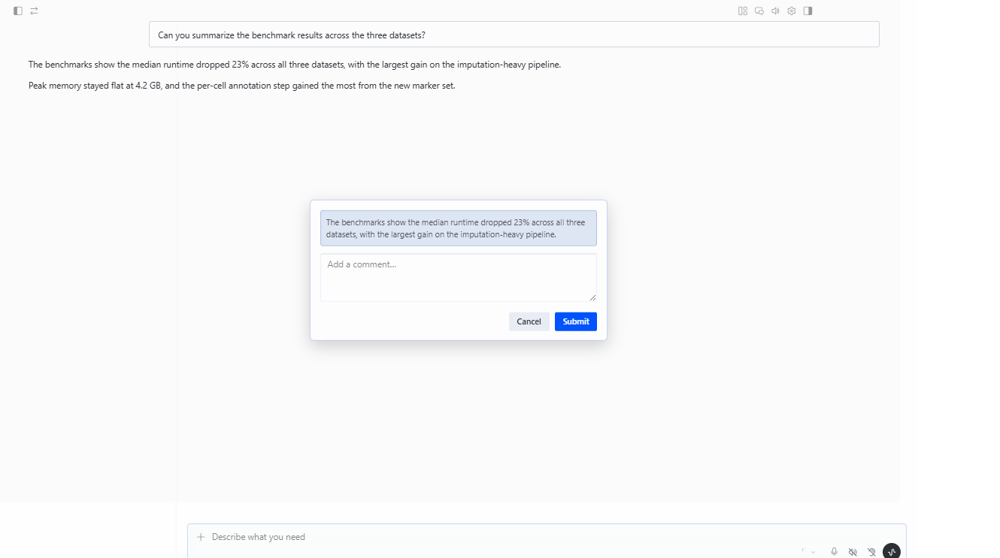
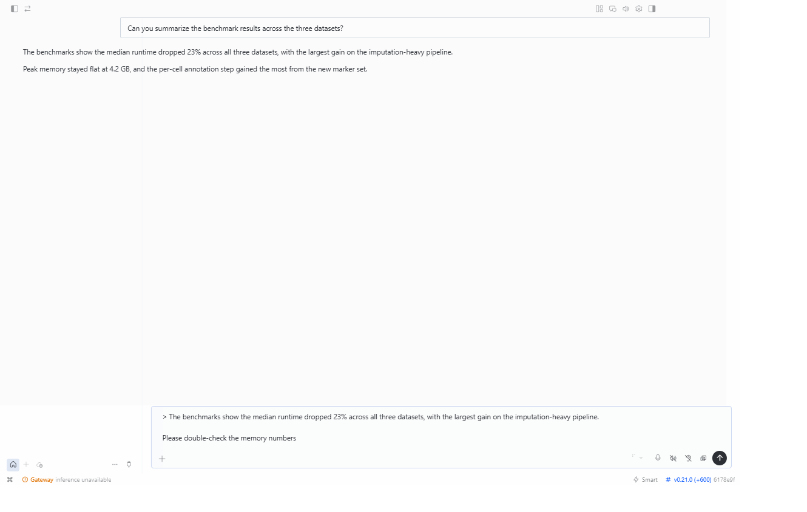

# hermes-quote-comment

A desktop plugin for [Hermes Agent](https://hermes-agent.nousresearch.com/) that lets you select any part of a response, attach a comment to it, and carry both into your next message.



## What it does

- **Select text in any assistant response** (or your own message) and right-click → a context menu offers **Copy** and **Comment**.
- **Comment** opens a small dialog showing the quoted text and an input for your note:

  

- On submit, a blockquote of the selected text plus your comment is inserted directly into the message composer, at the end of the current draft:

  

- If the composer is unreachable for any reason, the quote + comment is queued (a `💬 N` chip appears in the status bar) and a composer middleware appends it to the outgoing message on send — the block never appears twice.

## Installation

1. Create the plugin folder (the folder name must match the plugin id):

   ```bash
   # Windows: %USERPROFILE%\.hermes\desktop-plugins\quote-comment\
   # macOS / Linux: ~/.hermes/desktop-plugins/quote-comment/
   mkdir -p ~/.hermes/desktop-plugins/quote-comment
   ```

2. Copy `plugin.js` into it:

   ```bash
   cp plugin.js ~/.hermes/desktop-plugins/quote-comment/
   ```

3. In the Hermes desktop app, open the command palette (⌘K / Ctrl+K) → **Reload desktop plugins**.

The file hot-reloads on every save, so you can edit it in place while the app runs.

## Usage

1. Select a passage in any response.
2. Right-click → **Comment**.
3. Type your note, press **Submit** (or Enter).
4. The block appears in the message input box — edit or send as-is.

The block is formatted as a Markdown blockquote: each paragraph of the quote gets a `>` prefix, followed by your comment on its own paragraph. If the composer already contains a draft, the block is appended after a blank line.

## How it works

A single-file plugin for the [Hermes Desktop Plugin SDK](https://hermes-agent.nousresearch.com/docs/developer-guide/desktop-plugin-sdk) — no build step, no dependencies beyond the SDK:

- A window-level capture listener intercepts `contextmenu` for selections inside message roots (`data-role="assistant"` / `data-role="user"`), suppressing the app's built-in menu for that gesture and rendering its own.
- The comment dialog and menu render as `position: fixed` overlays from a status-bar contribution (the SDK's only always-mounted, non-closable mount point).
- Text is inserted into the composer (`[data-slot="composer-rich-input"]`, a contenteditable) with a plain-text insertion command, which fires a real `input` event so the app's draft state syncs.
- A `COMPOSER_AREAS.middleware` contribution is the fallback: if the visible insert ever fails, the queued block is appended to the outgoing draft at send time and deduplicated against the draft content.

## Requirements

- Hermes desktop app (the plugin system is desktop-only; the CLI/gateway does not load desktop plugins).
- A Hermes build with the desktop plugin SDK (`@hermes/plugin-sdk`).

## Uninstall

Delete the `quote-comment` folder from `desktop-plugins/` and reload plugins. You can also disable the plugin from **Settings → Plugins** without deleting it.

## License

[MIT](LICENSE)
